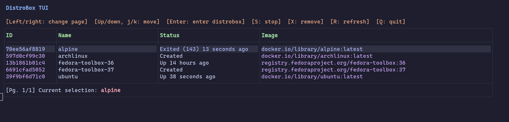

# distrobox-tui

[](https://goreportcard.com/report/github.com/phanirithvij/distrobox-tui)



A minimal TUI for [Distrobox](https://github.com/89luca89/distrobox) using
[Bubbletea](https://github.com/charmbracelet/bubbletea).

Features [Catppuccin](https://github.com/catppuccin/catppuccin) color palette.
Support for theme selection coming in future release.

My intention is to learn the Bubbletea framework by creating something (sort
of?) useful.

## Install

### Requirements

- Go 1.18+
- Distrobox
- Linux

```bash
go install github.com/phanirithvij/distrobox-tui@main
```

### Nix

It is available in nixpkgs unstable as `distrobox-tui`.

```shell
nix --extra-experimental-features "flakes nix-command" run github:nixos/nixpkgs/nixos-unstable#distrobox-tui
```

## Usage

- Must be run from the host OS
- Ensure `$GOPATH/bin` is in your shell's $PATH

```bash
distrobox-tui # looks for podman, docker, lilipod in that order

# To specify a container manager use one of
DBX_CONTAINER_MANAGER=podman distrobox-tui
DBX_CONTAINER_MANAGER=docker distrobox-tui
DBX_CONTAINER_MANAGER=lilipod distrobox-tui
```

Currently it is not possible to _create_ Distroboxes in the TUI, but this might
be added in the future.

For other planned things see [docs/ROADMAP.md](./docs/ROADMAP.md)

## Project history

This project is a continuation of the
[original](https://github.com/hyperreal64/distrobox-tui) project, created by
[@hyperreal64](https://github.com/hyperreal64).
